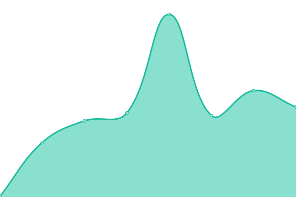
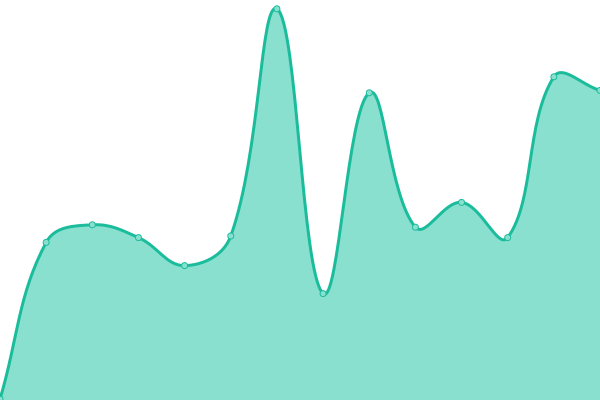

# [📈 Live Status](https://status.azuracast.com): <!--live status--> **🟩 All systems operational**

This repository contains the open-source uptime monitor and status page for [AzuraCast](https://azuracast.com/), powered by [Upptime](https://github.com/upptime/upptime).

With [Upptime](https://upptime.js.org), you can get your own unlimited and free uptime monitor and status page, powered entirely by a GitHub repository. We use [Issues](https://github.com/azuracast/status.azuracast.com/issues) as incident reports, [Actions](https://github.com/azuracast/status.azuracast.com/actions) as uptime monitors, and [Pages](https://status.azuracast.com) for the status page.

<!--start: status pages-->
<!-- This summary is generated by Upptime (https://github.com/upptime/upptime) -->
<!-- Do not edit this manually, your changes will be overwritten -->
<!-- prettier-ignore -->
| URL | Status | History | Response Time | Uptime |
| --- | ------ | ------- | ------------- | ------ |
|  [AzuraCast Homepage](https://www.azuracast.com) | 🟩 Up | [azura-cast-homepage.yml](https://github.com/AzuraCast/status.azuracast.com/commits/HEAD/history/azura-cast-homepage.yml) | 

 215ms
     
 | 

<a href="https://status.azuracast.com/history/azura-cast-homepage">100.00%</a>
    

|  [AzuraCast Docs](https://docs.azuracast.com) | 🟩 Up | [azura-cast-docs.yml](https://github.com/AzuraCast/status.azuracast.com/commits/HEAD/history/azura-cast-docs.yml) | 

 185ms
     
 | 

<a href="https://status.azuracast.com/history/azura-cast-docs">100.00%</a>
    

|  [AzuraCast Central](https://central.azuracast.com) | 🟩 Up | [azura-cast-central.yml](https://github.com/AzuraCast/status.azuracast.com/commits/HEAD/history/azura-cast-central.yml) | 

 140ms
     
 | 

<a href="https://status.azuracast.com/history/azura-cast-central">100.00%</a>
    

|  [AzuraCast Demo Instance](https://demo.azuracast.com/api/nowplaying/1) | 🟩 Up | [azura-cast-demo-instance.yml](https://github.com/AzuraCast/status.azuracast.com/commits/HEAD/history/azura-cast-demo-instance.yml) | 

 208ms
     
 | 

<a href="https://status.azuracast.com/history/azura-cast-demo-instance">100.00%</a>
    

<!--end: status pages-->

[**Visit our status website →**](https://status.azuracast.com)

## 📄 License

- Powered by: [Upptime](https://github.com/upptime/upptime)
- Code: [MIT](./LICENSE) © [AzuraCast](https://azuracast.com/)
- Data in the `./history` directory: [Open Database License](https://opendatacommons.org/licenses/odbl/1-0/)
